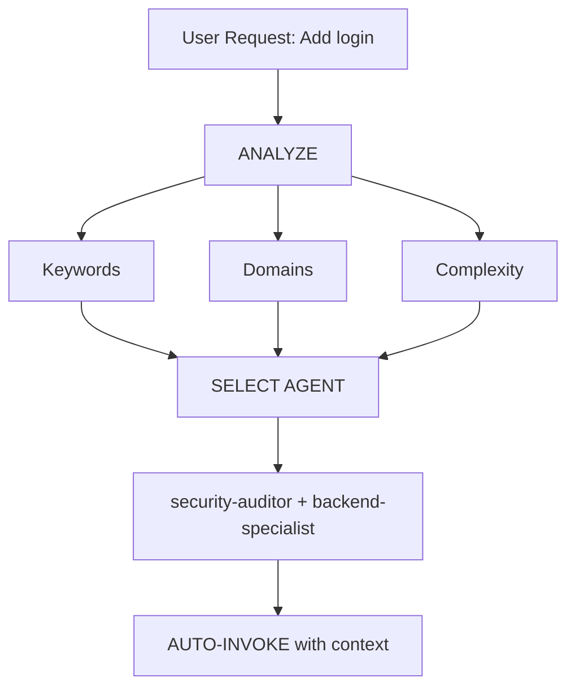

# 1. Request Analysis

Before responding to ANY user request, perform automatic analysis:

```mermaid
graph TD
    A[User Request: Add login] --> B[ANALYZE]
    B --> C[Keywords]
    B --> D[Domains]
    B --> E[Complexity]
    C --> F[SELECT AGENT]
    D --> F
    E --> F
    F --> G[security-auditor + backend-specialist]
    G --> H[AUTO-INVOKE with context]
```